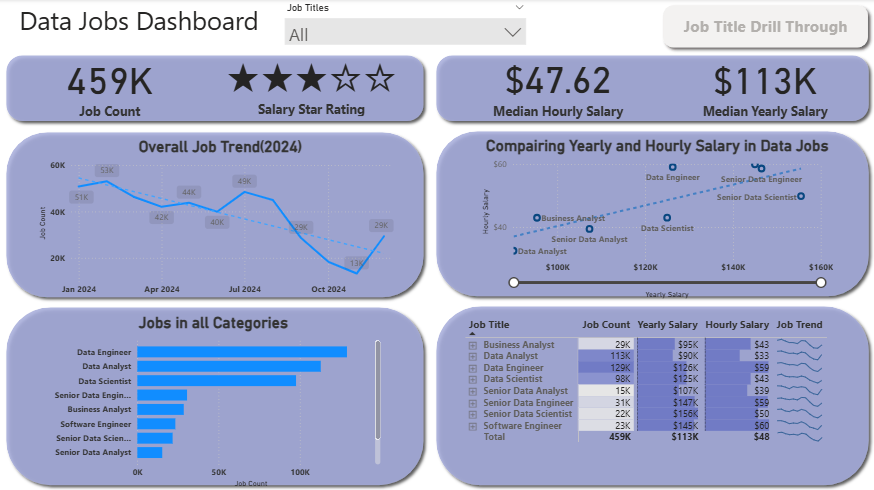
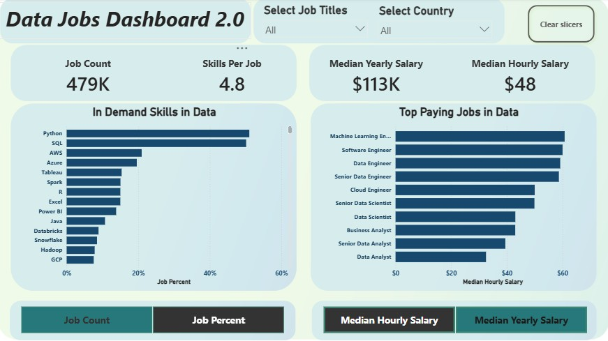

## 📊 Power BI Dashboard Portfolio
*Turning raw job-market data into interactive, actionable insights 🚀*

This portfolio showcases **advanced Power BI dashboards** built to explore real-world data through  
**clean design, smart interactivity, and business-ready storytelling**.

Each dashboard focuses on:
- 📈 Clear KPIs and trends
- 🎯 Insight-driven visuals
- 🧠 User-friendly exploration for decision-making

---

## 💼 Data Jobs Dashboard 1 — Power Bi

  

### 🛠️ Key Skills & Techniques Applied

- 🎨 **Dashboard Layout & Visual Design**
- 🔄 **Power Query (ETL & Data Shaping)**
- 🔗 **Basic Data Modeling & Table Relationships**
- 📐 **Implicit Measures & Standard Aggregations**
- 📊 **Core Charts** (Bar, Line, Area, Column)
- 🗺️ **Map Visualizations** for Geospatial Insights
- 📌 **KPI Cards & Detailed Data Tables**
- 🎛️ **Interactive Slicers** for Dynamic Filtering
- 🔘 **Buttons & Bookmarks** for Smooth Navigation
- 🔍 **Drill-Through Functionality** for Deep Dives

> 💡 *Designed to help job seekers and analysts explore trends, salaries, demand, and opportunities — all in a few clicks.*

[**View Full Project-1 Details (README)**](/Data_jobs_project_1/README.md) 

---

## 📊 Data Jobs Dashboard 2 — Power BI
*A focused look at the 2024 data job market with skill-driven and salary-focused insights 🚀*

  

This dashboard analyzes **2024 data job postings** to highlight **role-based demand, skill distribution, and salary patterns**, with a strong emphasis on **interactive exploration** rather than static KPIs.

---

### 🧠 Skills & Techniques Used

- 🔄 **Power Query (ETL & Data Shaping)**  
  Data cleaning, transformation, and preparation for analysis.

- 🧮 **Explicit DAX Measures**  
  Custom measures for job counts, percentages, salary calculations, and skill metrics.

- 🧱 **Parameters (Fields) for Dynamic Analysis**  
  Used to switch between views such as **job count vs job percent** and **hourly vs yearly salary**.

> 🎯 *Built to help users quickly compare roles, skills, and salaries — all through interaction.*

[**View Full Project-2 Details (README)**](/Data_jobs_project_2/README.md) 

---

## 🚀 Portfolio Overview

This Power BI portfolio presents **interactive, real-world dashboards** built to uncover insights from job market data.  
Each project highlights **strong data modeling, thoughtful visualization, and business-oriented analysis**, enabling users to explore trends, skills, and opportunities with ease.

> 🎯 *A collection focused on turning complex data into clear, actionable stories.*

